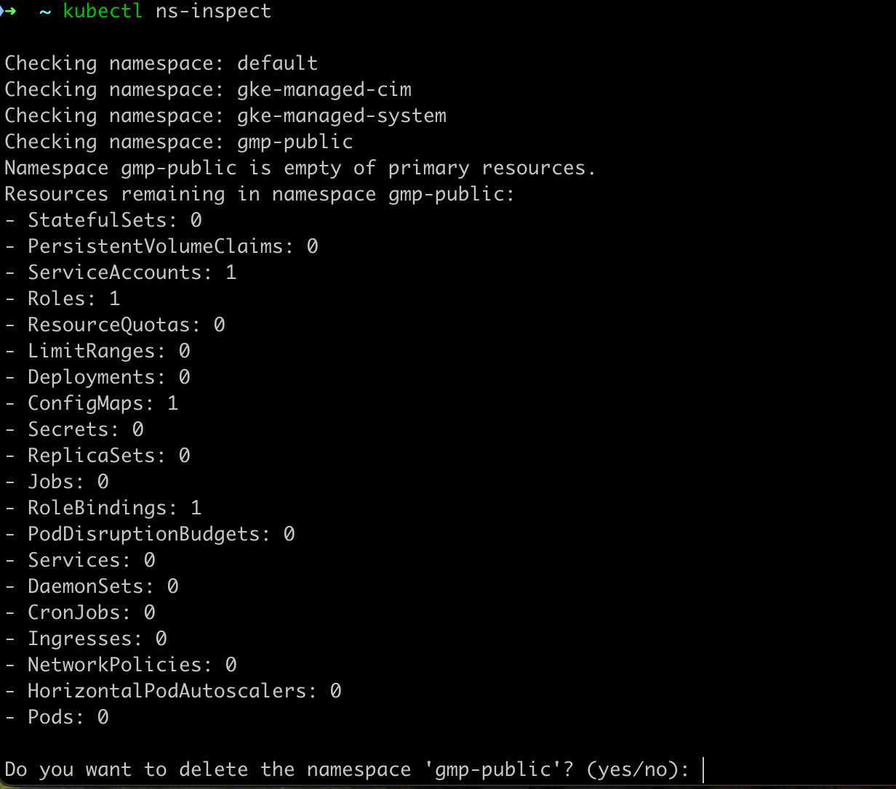

# kubectl-ns-inspect
kubectl-ns-inspect is a kubectl plugin that inspects a given Kubernetes namespace to check if it contains any resources (e.g., Pods, Services, ConfigMaps, etc.). It can also optionally prompt the user to delete namespaces that are deemed empty of primary resources.

## Using kubectl-ns-inspect plugin
### Installing
Install Krew by following the instructions here.
Run the following commands to install kubectl-ns-inspect plugin:
bash

```
kubectl krew update
kubectl krew install ns-inspect
```

### Usage
Inspect all namespaces for resources
You can inspect all namespaces in a cluster and see which ones are empty of primary resources (e.g., Pods, Services):


```
kubectl ns-inspect
```

#### Example



#### Perform a dry-run inspection
To inspect namespaces without making any changes, you can run the plugin in dry-run mode. This mode will list the namespaces and their contents, but no deletions will occur:

```
kubectl ns-inspect --dry-run
```

#### Delete empty namespaces after inspection
After inspecting the namespaces, kubectl-ns-inspect can prompt the user to delete namespaces that are deemed empty of primary resources:

```
kubectl ns-inspect
```
When prompted, enter yes to delete an empty namespace or no to skip deletion.


## Supported Platforms: darwin / arm64


Compatibility with other operating systems and architectures is planned for future releases.


# Additional Information


#### Cluster Context

The plugin operates based on the current Kubernetes context. It uses the context specified in the KUBECONFIG environment variable, or if this is not set, it defaults to the configuration found at $HOME/.kube/config.

```
kubeconfig := os.Getenv("KUBECONFIG")
if kubeconfig == "" {
    homeDir, err := os.UserHomeDir()
    if err != nil {
        log.Fatalf("Error getting user home directory: %v", err)
    }
    kubeconfig = filepath.Join(homeDir, ".kube", "config")
}
```


#### Empty Namespace Criteria:

A namespace is considered empty if it does not contain any Services, Pods, or ResourceQuotas. After identifying such a namespace, the plugin will list all remaining resources inside that namespace. You will then be prompted to confirm whether you want to delete the namespace:


</br>
